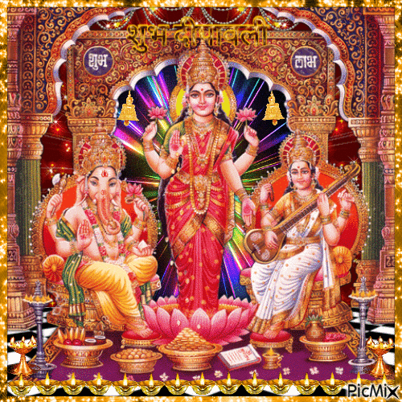

<!DOCTYPE html>
<html lang="en">
<head>
    <meta charset="UTF-8">
    <meta name="viewport" content="width=device-width, initial-scale=1.0">
    <title>শুভ দীপাবলি</title>
    <link rel="stylesheet" href="https://cdnjs.cloudflare.com/ajax/libs/font-awesome/6.0.0-beta3/css/all.min.css"> <!-- Font Awesome for icons -->
    
</head>
<body>
    

    

        <h1 id="greetingText">শুভ দীপাবলি!</h1>
        

        
         

        

            আলোর উৎসব দীপাবলির এই শুভক্ষণে, আপনার জীবন সুখ, সমৃদ্ধি ও আনন্দে ভরে উঠুক। দেবী লক্ষ্মী আপনার গৃহে শান্তি ও ঐশ্বর্য নিয়ে আসুক।
        

        <label for="yourName">আপনার নাম লিখুন:</label>
        <input type="text" id="yourName" placeholder="আপনার নাম">
        
        

            <button onclick="shareViaWhatsApp()" class="whatsapp-share-button">
                <i class="fab fa-whatsapp"></i> WhatsApp এ শেয়ার করুন
            </button>
        

        
        <!-- The following div is now completely hidden, as per your request -->
        

            
আপনার তৈরি লিঙ্ক:

            

            <button onclick="copyLink()" style="margin-top: 15px;">লিঙ্ক কপি করুন</button>
        

    

    
</body>
</html>

